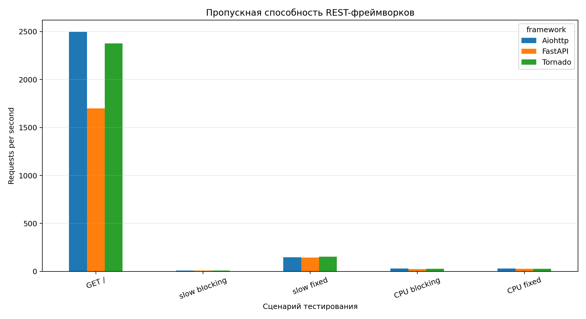
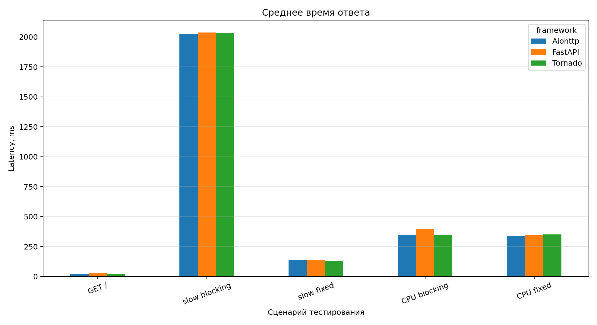
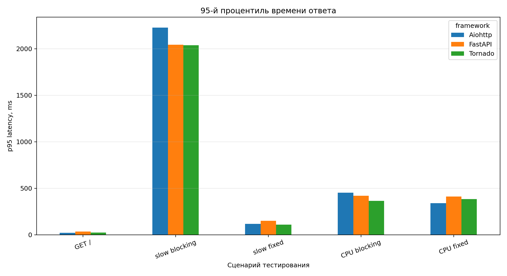
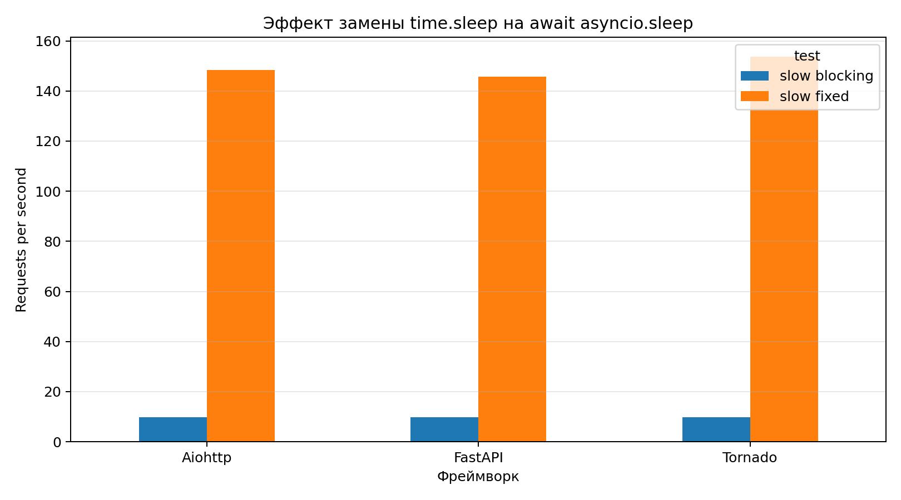

# Отчёт по лабораторной работе  
## Нагрузочное тестирование REST API и сравнение REST-фреймворков

**Выполнил:** Киселев Георгий Петрович  
**Группа:** ИВТ-1.1  
**Дисциплина:** Компьютерный практикум

---

## 1. Цель работы

Цель работы — воспроизвести пример нагрузочного тестирования REST API, рассмотренный на занятии, проанализировать проблему блокирующих операций в асинхронном сервере, а также сравнить производительность нескольких REST-фреймворков при одинаковых сценариях нагрузки.

В работе сравнивались следующие фреймворки:

- FastAPI;
- Aiohttp;
- Tornado.

В качестве инструмента нагрузочного тестирования использовался **Apache Benchmark** (`ab`).

---

## 2. Краткое описание задания

По заданию необходимо было:

1. Воспроизвести пример, показанный на занятии.
2. Прокомментировать различие между `high_cpu_endpoint` и `high_cpu_endpoint_fixed`.
3. Выбрать 2–3 других REST-фреймворка и сравнить их работу.
4. Провести нагрузочное тестирование.
5. Привести таблицы, графики и анализ результатов.
6. Сформулировать общие принципы проведения стресс-тестирования на выбранной платформе.

---

## 3. Используемые инструменты

Для выполнения работы использовались:

- Python 3.13.5;
- FastAPI 0.128.2;
- Uvicorn 0.48.0;
- Aiohttp 3.13.3;
- Tornado 6.5.6;
- Apache Benchmark 2.3;
- Pandas 2.2.3;
- Matplotlib 3.10.8.

Нагрузочные тесты выполнялись локально. Для честного сравнения все серверы запускались в одном процессе, без режима `--reload` и без нескольких воркеров.

---

## 4. Описание тестируемых endpoint'ов

В каждом приложении были реализованы одинаковые маршруты.

| Endpoint | Назначение |
|---|---|
| `/` | Быстрый тестовый endpoint, возвращающий JSON-ответ |
| `/slow_endpoint` | Endpoint с блокирующей задержкой `time.sleep(0.1)` |
| `/slow_endpoint_fixed` | Исправленный endpoint с неблокирующим ожиданием `await asyncio.sleep(0.1)` |
| `/high_cpu_endpoint` | CPU-bound endpoint, выполняющий вычислительный цикл прямо в обработчике запроса |
| `/high_cpu_endpoint_fixed` | CPU-bound endpoint, где вычисление вынесено через `asyncio.to_thread()` |

В исходном примере с занятия CPU-задача выполняла цикл на `10_000_000` итераций. В данной работе для локального тестирования использовалось значение `1_000_000` итераций, чтобы тесты на всех фреймворках выполнялись за разумное время. Логика проблемы от этого не меняется: задача всё равно остаётся CPU-bound.

---

## 5. Ситуация с `slow_endpoint` и `slow_endpoint_fixed`

В `slow_endpoint` используется блокирующая операция:

```python
@app.get("/slow_endpoint")
async def slow_endpoint():
    time.sleep(0.1)
    return {"message": "This was a slow request"}
```

Несмотря на то, что функция объявлена как `async`, вызов `time.sleep()` блокирует поток выполнения. Для асинхронного сервера это особенно плохо, потому что блокируется event loop. Пока выполняется `time.sleep()`, сервер не может эффективно переключаться на обработку других запросов.

Исправленный вариант выглядит так:

```python
@app.get("/slow_endpoint_fixed")
async def slow_endpoint_fixed():
    await asyncio.sleep(0.1)
    return {"message": "This was asyncio sleep"}
```

`asyncio.sleep()` не блокирует event loop. Сервер может принять другие запросы, пока текущий запрос находится в ожидании. Поэтому при конкурентной нагрузке исправленный endpoint показывает намного большую пропускную способность.

---

## 6. Ситуация с `high_cpu_endpoint` и `high_cpu_endpoint_fixed`

Проблемный вариант:

```python
@app.get("/high_cpu_endpoint")
async def high_cpu_endpoint():
    def cpu_intensive_task():
        total = 0
        for i in range(1_000_000):
            total += i
        return total

    result = cpu_intensive_task()
    return {"result": result}
```

Здесь тяжёлая CPU-задача выполняется прямо внутри обработчика запроса. Если сервер асинхронный, такой код блокирует event loop так же, как и `time.sleep()`. Пока выполняется цикл, сервер хуже реагирует на другие запросы.

Исправленный вариант:

```python
@app.get("/high_cpu_endpoint_fixed")
async def high_cpu_endpoint_fixed():
    result = await asyncio.to_thread(cpu_intensive_task)
    return {"result": result}
```

`asyncio.to_thread()` переносит выполнение CPU-функции в отдельный поток. Это разгружает event loop, и сервер может продолжать принимать другие соединения. Однако важно понимать, что это не делает саму CPU-задачу быстрее. В Python для чистых вычислений действует ограничение GIL, поэтому прирост RPS может быть небольшим или почти отсутствовать.

Главный смысл `high_cpu_endpoint_fixed` — не ускорить вычисление, а не блокировать event loop. Для настоящих тяжёлых CPU-задач лучше использовать несколько процессов, отдельный worker-сервис, очередь задач, `ProcessPoolExecutor` или выносить вычисления в более производительный код.

---

## 7. Конфигурация нагрузочного тестирования

Для тестирования использовался Apache Benchmark.

Примеры команд:

```bash
ab -n 500 -c 50 http://127.0.0.1:8000/
ab -n 60 -c 20 http://127.0.0.1:8000/slow_endpoint
ab -n 100 -c 20 http://127.0.0.1:8000/slow_endpoint_fixed
ab -n 30 -c 10 http://127.0.0.1:8000/high_cpu_endpoint
ab -n 30 -c 10 http://127.0.0.1:8000/high_cpu_endpoint_fixed
```

Параметры:

- `-n` — общее количество запросов;
- `-c` — количество одновременных запросов;
- `Requests per second` — количество обработанных запросов в секунду;
- `Time per request` — среднее время обработки запроса;
- `p95` и `p99` — 95-й и 99-й процентили времени ответа;
- `Failed requests` — количество неуспешных запросов.

---

## 8. Запуск серверов

FastAPI запускался через Uvicorn:

```bash
CPU_ITERATIONS=1000000 uvicorn app_fastapi:app --host 127.0.0.1 --port 8000 --workers 1
```

Aiohttp:

```bash
CPU_ITERATIONS=1000000 python app_aiohttp.py 8001
```

Tornado:

```bash
CPU_ITERATIONS=1000000 python app_tornado.py 8002
```

---

## 9. Результаты тестирования

| framework   | endpoint                 |   requests |   concurrency |     rps |   mean_ms |   p95_ms |   p99_ms |   failed_requests |
|:------------|:-------------------------|-----------:|--------------:|--------:|----------:|---------:|---------:|------------------:|
| FastAPI     | /                        |        500 |            50 | 1698.06 |     29.44 |       36 |       37 |                 0 |
| FastAPI     | /slow_endpoint           |         60 |            20 |    9.81 |   2037.77 |     2043 |     2043 |                 0 |
| FastAPI     | /slow_endpoint_fixed     |        100 |            20 |  145.65 |    137.32 |      152 |      153 |                 0 |
| FastAPI     | /high_cpu_endpoint       |         30 |            10 |   25.43 |    393.18 |      421 |      429 |                 0 |
| FastAPI     | /high_cpu_endpoint_fixed |         30 |            10 |   28.82 |    347.00 |      412 |      445 |                 0 |
| Aiohttp     | /                        |        500 |            50 | 2495.60 |     20.04 |       23 |       25 |                 0 |
| Aiohttp     | /slow_endpoint           |         60 |            20 |    9.86 |   2028.20 |     2228 |     2831 |                 0 |
| Aiohttp     | /slow_endpoint_fixed     |        100 |            20 |  148.42 |    134.75 |      119 |      119 |                 0 |
| Aiohttp     | /high_cpu_endpoint       |         30 |            10 |   29.12 |    343.42 |      452 |      453 |                 0 |
| Aiohttp     | /high_cpu_endpoint_fixed |         30 |            10 |   29.52 |    338.77 |      340 |      340 |                 0 |
| Tornado     | /                        |        500 |            50 | 2376.32 |     21.04 |       24 |       25 |                 0 |
| Tornado     | /slow_endpoint           |         60 |            20 |    9.84 |   2033.42 |     2037 |     2037 |                 0 |
| Tornado     | /slow_endpoint_fixed     |        100 |            20 |  153.73 |    130.10 |      110 |      111 |                 0 |
| Tornado     | /high_cpu_endpoint       |         30 |            10 |   28.69 |    348.60 |      364 |      366 |                 0 |
| Tornado     | /high_cpu_endpoint_fixed |         30 |            10 |   28.53 |    350.54 |      384 |      402 |                 0 |

---

## 10. Графики

### Рисунок 1 — пропускная способность



### Рисунок 2 — среднее время ответа



### Рисунок 3 — 95-й процентиль времени ответа



### Рисунок 4 — эффект исправления `slow_endpoint`



---

## 11. Анализ результатов

На простом endpoint `/` все фреймворки показали высокую производительность. В данном запуске Aiohttp и Tornado оказались быстрее FastAPI по RPS. Это объясняется тем, что FastAPI использует дополнительный слой обработки запросов, валидации и сериализации через ASGI-стек. При этом на реальном проекте разница может измениться из-за бизнес-логики, middleware, базы данных и настроек сервера.

На `/slow_endpoint` результаты резко ухудшились у всех фреймворков. Пропускная способность составила около 9.8 RPS, а среднее время ответа при конкурентности 20 приблизилось к 2 секундам. Это произошло из-за использования `time.sleep(0.1)`, который блокирует поток и не позволяет асинхронному серверу эффективно обслуживать параллельные запросы.

На `/slow_endpoint_fixed` производительность выросла примерно до 145–154 RPS. Это подтверждает, что для операций ожидания, сетевого ввода-вывода, работы с базой данных и внешними API в асинхронном коде нужно использовать неблокирующие операции. Замена `time.sleep()` на `await asyncio.sleep()` позволила event loop продолжать обработку других запросов.

Для CPU-bound endpoint'ов разница между обычной и исправленной версией оказалась небольшой. Например, у FastAPI RPS вырос с 25.43 до 28.82, у Aiohttp — с 29.12 до 29.52, а у Tornado результат практически не изменился. Это связано с тем, что `asyncio.to_thread()` не уменьшает объём вычислений. Он только переносит вычисление в поток, освобождая event loop. Поэтому `high_cpu_endpoint_fixed` полезен для отзывчивости сервера, но не является полноценным способом масштабирования тяжёлых вычислений.

Во всех тестах количество ошибок было равно нулю. Это означает, что при выбранной нагрузке серверы не падали и корректно отвечали на запросы.

---

## 12. Общие принципы стресс-тестирования REST API

При проведении стресс-тестирования важно придерживаться нескольких правил.

Во-первых, нужно тестировать один и тот же сценарий на одинаковой конфигурации. Нельзя сравнивать один сервер с одним воркером, а другой — с несколькими воркерами, потому что результаты будут некорректными.

Во-вторых, нужно отдельно проверять разные типы нагрузки: быстрые endpoint'ы, endpoint'ы с I/O-ожиданием, CPU-bound endpoint'ы, работу с базой данных и внешними API. Разные типы задач создают разные узкие места.

В-третьих, нельзя оценивать производительность только по среднему времени ответа. Среднее значение может скрывать медленные запросы. Поэтому обязательно нужно смотреть p95 и p99, так как они показывают качество работы сервиса для пользователей, которые попали в худшие 5% или 1% запросов.

В-четвёртых, важно учитывать процент ошибок. Высокий RPS не имеет смысла, если часть запросов завершается таймаутами или ошибками 5xx.

В-пятых, перед основным тестом желательно выполнять прогрев сервера. Первый запуск может быть медленнее из-за инициализации приложения, кэшей и соединений.

В-шестых, при тестировании нужно следить за ресурсами системы: загрузкой CPU, памятью, диском, сетевыми соединениями. Без этого сложно понять, где находится узкое место.

В-седьмых, тесты нужно повторять несколько раз и усреднять результаты. Один запуск может быть неточным из-за фоновых процессов операционной системы.

---

## 13. Вывод

В ходе работы был воспроизведён пример нагрузочного тестирования REST API и проведено сравнение FastAPI, Aiohttp и Tornado. Эксперимент показал, что асинхронный фреймворк сам по себе не гарантирует высокую производительность. Если внутри `async`-обработчика используется блокирующий код, например `time.sleep()` или тяжёлый CPU-цикл, event loop блокируется, и сервер начинает хуже обслуживать параллельные запросы.

Исправление `slow_endpoint` через `await asyncio.sleep()` дало значительный прирост производительности, потому что операция стала неблокирующей. Исправление `high_cpu_endpoint` через `asyncio.to_thread()` помогло разгрузить event loop, но почти не увеличило RPS, так как CPU-bound задача всё равно требует процессорного времени.

По результатам тестов можно сделать главный вывод: для I/O-bound задач асинхронность даёт заметный выигрыш, а для CPU-bound задач необходимо использовать другие подходы — несколько воркеров, процессы, очереди задач или отдельные сервисы для вычислений.
